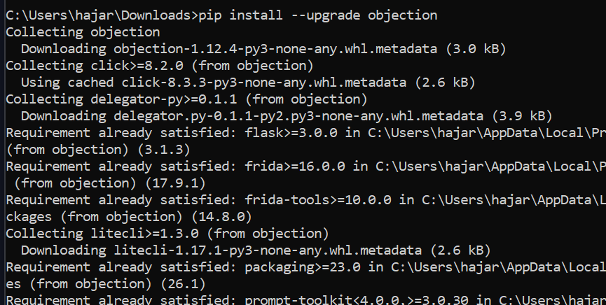
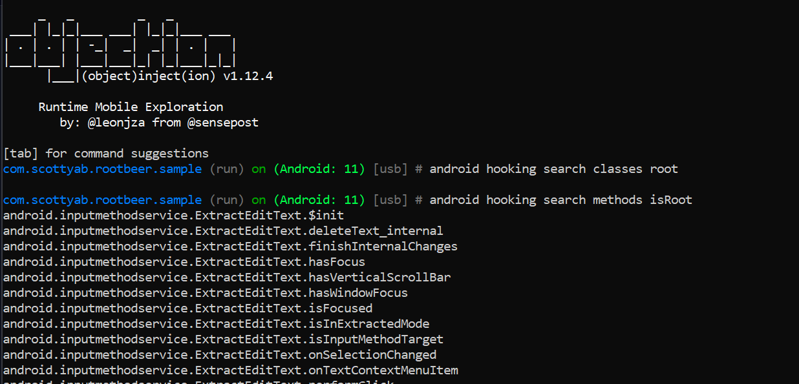
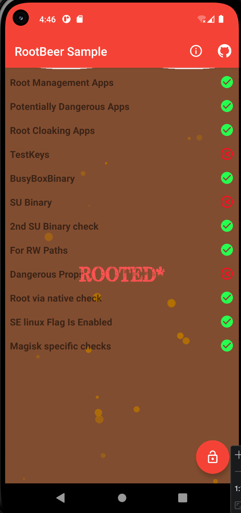
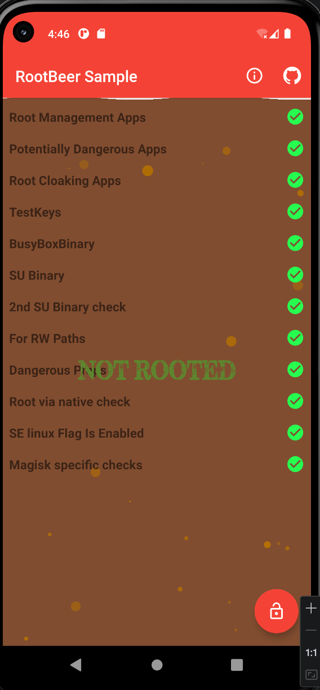
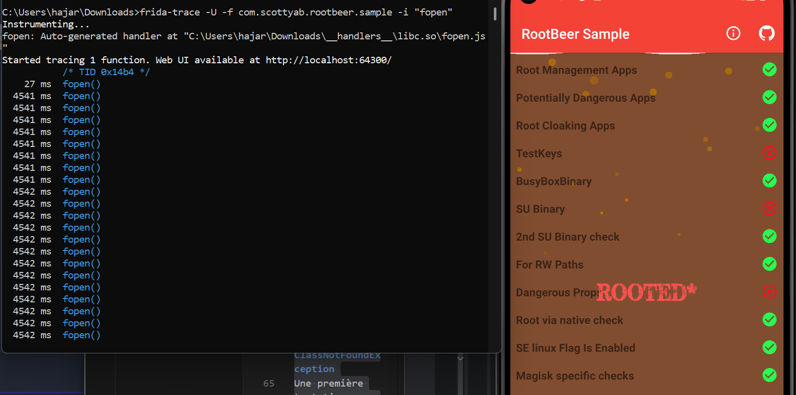

# Rapport de Lab : Sécurité des Applications Mobiles
## LAB 13 — Bypass de la Détection de Root Android avec Objection

**Étudiant :** Chaira Hajar


---

## Introduction
Ce rapport présente les résultats du LAB 13 portant sur l'utilisation d'**Objection**, un outil d'exploration runtime basé sur Frida. L'objectif est de démontrer comment simplifier le processus de bypass de root en utilisant des commandes intégrées pour neutraliser les vérifications Java et natives de l'application RootBeer Sample.

---

## Étape 1 : Installation et Prérequis

###  Installation d'Objection
Objection a été installé via le gestionnaire de paquets Python `pip`. Nous avons également validé la présence de Frida et ADB sur le système.

> [!NOTE]
> 


---

## Étape 2 : Démarrage et Visibilité

### 2.1 Lancement de la Session (Spawn)
Nous avons utilisé la stratégie "Spawn" pour injecter les hooks dès le démarrage de l'application. La commande `explore` permet d'ouvrir la console interactive d'Objection.

**Commande :**
```powershell
objection -g com.scottyab.rootbeer.sample explore --startup-command "android root disable"
```

> [!NOTE]
> 

---

## Étape 3 : Exploration du Code (Runtime)

### 3.1 Recherche de Classes et Méthodes
Objection permet de fouiller la mémoire de l'application pour identifier les mécanismes de détection.

> [!NOTE]
> **Recherche des classes liées au root et methodes  :**
> 

---

## Étape 4 : Bypass Java avec Objection

### 4.1 Interception des Méthodes
Grâce à la commande `android root disable`, Objection identifie automatiquement les bibliothèques connues (comme RootBeer) et applique des hooks sur les méthodes de détection.

> [!NOTE]
> **Logs d'interception en temps réel :**
> 

### 4.2 Validation du Bypass
L'application RootBeer Sample, initialement en état "Rooted", passe désormais en état **"NOT ROOTED"** avec tous les indicateurs au vert.

> [!IMPORTANT]
> **État initial (Avant) :**
> 
>
> **État final (Après Bypass) :**
> 

---

## Étape 5 : Bonus Natif — Analyse avec Frida-Trace

### 5.1 Identification des Appels Système
Pour aller plus loin, nous avons utilisé `frida-trace` pour isoler les appels système `fopen` effectués par la bibliothèque native de RootBeer (`rootbeerutils`). Cela prouve que l'app cherche activement des fichiers comme `/system/bin/su` au niveau natif.

**Commande :**
```powershell
frida-trace -U -f com.scottyab.rootbeer.sample -i "fopen"
```

> [!NOTE]
> **Tracé des appels natifs fopen :**
> 

---

## Conclusion
Le LAB 13 a démontré l'efficacité d'Objection pour l'analyse rapide d'applications Android. La commande `android root disable` permet de couvrir la majorité des tests de détection classiques, tandis que `frida-trace` complète l'analyse en révélant les comportements natifs de l'application.

---

